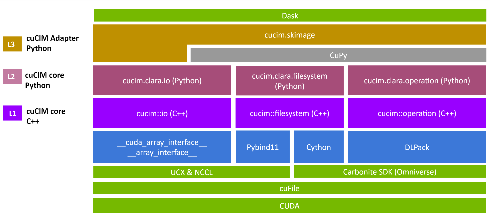

<!-- ```{eval-rst}
:notoc:

``` -->

```{toctree}
:maxdepth: 3
:hidden:

getting_started/index
api_reference/index
release_notes/index
roadmap/index
```
<!-- user_guide/index
development/index -->


# cuCIM Documentation

Current latest version is [Version 23.06.00](release_notes/v23.06.00.md).

**cuCIM** a toolkit to provide GPU accelerated I/O, image  processing & computer vision primitives for N-Dimensional images with a focus on biomedical imaging.

:::{figure-md} fig-cucim-architecture
:class: myclass



RAPIDS cuCIM Architecture
:::

<!-- .. raw:: html
   <div> </div> -->

<!-- ```{toctree}
:maxdepth: 3
:hidden:


reference/index.md

``` -->

<!--
```{include} readme.md
```

## Site contents

```{toctree}
:maxdepth: 2
:caption: Main docs

jupyter.md
installation.md
usage.md
changelog.md
Github repository <https://github.com/rapidsai/cucim>
```

## Reference pages

```{toctree}
:caption: Reference items
:maxdepth: 2

reference/index.md
```

## Development

```{toctree}
:caption: Development
:maxdepth: 1

contributing.md
authors.md
```

## Indices and tables

* {ref}`genindex`
* {ref}`modindex`
* {ref}`search`
 -->
